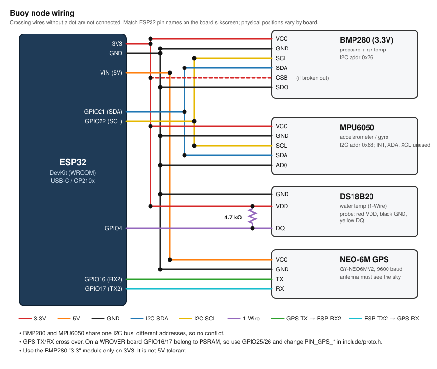

# hackgt-26

Mesh of ESP32 sensor buoys. Each buoy logs readings, and the buoys gossip every node's data between themselves. An ESP32 plugged into a laptop can pull the whole fleet's data from any one buoy it reaches.

## Wiring

Text version with pin table: [docs/wiring.md](docs/wiring.md)



## Firmware

Requires PlatformIO (`pip install platformio pyserial`).

| Env | Flash to | Purpose |
|---|---|---|
| `buoy` | each buoy | real sensors |
| `buoy_demo` | each buoy | real sensors, one reading every 2 s instead of 30 s, for a live demo |
| `buoy_debug` | a buoy on the bench | real sensors, logs everything at 115200: raw GPS NMEA, every sensor each second, every radio frame with RSSI, reset reason |
| `buoy_sim` | spare ESP32s | fake readings, to test the mesh without wiring. `BACKFILL <n>` over serial queues n extra records, for load tests. |
| `collector` | the ESP32 on the laptop | bridges the mesh to USB serial |
| `meshsim` | any one ESP32 | runs virtual buoys + collector over a lossy fake radio and prints PASS/FAIL. Wipes the board's flash. |

```
pio run -e buoy -t upload --upload-port COM5
pio device monitor -p COM5            # boot log, I2C scan, one sample every 30 s; type STAT for counters
```

Collect data into SQLite:

```
pio run -e collector -t upload --upload-port COM6
python tools/collector.py COM6 --db buoy.db
```

| Table | Rows | Source |
|---|---|---|
| `readings` | one per buoy sample (every 30 s, or 2 s with `buoy_demo`) | stored and relayed by the mesh; nothing is lost |
| `motion` | 50 per second per buoy: accel (g), gyro (deg/s), orientation quaternion and roll/pitch/yaw | live only, from buoys in direct range of the collector; committed within 0.5 s, for 3D rendering |

The motion axes are the buoy's: x forward, y left, z up. The quaternion `qw qx qy qz` rotates buoy to world. It comes from a Mahony filter over the accelerometer and gyro. Yaw drifts about 0.5 deg/min, because there's no magnetometer.

## Web console (Tideline)

Map of the fleet, a 3D page per buoy (RAY.stl, tilting live, with an acceleration arrow), alerts, and a voice agent.

Needs Python 3.10+ and Node 20.19+.

```
python -m venv .venv
.venv\Scripts\activate          # macOS/Linux: source .venv/bin/activate
pip install -r requirements.txt
cd web && npm install && npm run build && cd ..
python server/app.py --serial COM5      # runs the collector too; open http://localhost:8000
```

- Without `--serial`, it only reads `buoy.db`, so you can run `tools/collector.py` yourself.
- Voice: put `XAI_API_KEY=...` (Grok Voice) and/or `GEMINI_API_KEY=...` (Gemini Live) in `.env` at the repo root; the Grok / Gemini switch in the header picks one. The browser gets a short-lived token from the backend and talks to the provider directly. Use Chrome.
  - Optional: `VOICE_PROVIDER=gemini` (default provider), `GEMINI_LIVE_MODEL` (default `gemini-3.8-live`; `gemini-3.8-live-extended-thinking` works but takes ~20 s per answer), `GEMINI_VOICE`, `XAI_VOICE`.
- No GPS fix indoors: buoys sit on a ring around the map center (dashed dot). Drag them with the pin button on the map; positions and names are saved in `server/fleet.json`.
- `--sim-fleet 8` adds 8 fake buoys around campus for a fuller map (they aren't written to the DB).
- UI dev: `python server/app.py` plus `npm run dev` in `web/` (proxies to :8000).

## How the mesh works

- Every 30 s, each buoy stores a record in flash. A record holds water temperature, air temperature, pressure, GPS position and time, and wave statistics: vertical-accel RMS and peak, plus tilt, from 50 Hz IMU sampling.
- A buoy broadcasts each new reading as soon as it takes it (collector in range: ~13 ms from sample to DB).
- Every ~5 s, each node broadcasts a summary of which records it holds per buoy over ESP-NOW. Neighbors send each other whatever is missing, so every buoy ends up with a copy of every buoy's data.
- A receiver only accepts the next record in sequence. When it spots a gap, it immediately sends a NACK saying "resend from N".
- A receiver skips a gap only once no neighbor it has heard in the last 30 s still holds those records (they were evicted everywhere).
- The collector advertises what the laptop's DB already has, so buoys only send new records. Once the DB commits, the collector's ack spreads through the mesh and buoys delete the delivered data.
- Buoys serve the collector before lagging buoys, since delivered records get deleted anyway.
- Serial lines to the laptop carry a CRC. On a bad or missing line, `collector.py` asks the collector to resend from its last ack.
- While a collector is in direct range, a buoy also broadcasts its raw 50 Hz IMU samples, 16 per frame (~3 frames/s). These are read from the MPU's FIFO, so loop stalls don't drop any. They're never stored or relayed.

Tunables (sample period, channel, long-range mode) and pins are in `include/proto.h`.

- Long-range mode (`MESH_LONG_RANGE`) roughly doubles range, but every node must run the same setting.
- The mesh only runs between ESP32s.
- Flash holds about 35k records (measured). Every buoy keeps a copy of every buoy's data, so that is shared across the fleet: about 4 days with the laptop offline for 3 buoys at 30 s, 29 h for 10 buoys, 6.5 h for 3 buoys at the 2 s demo rate. After that the oldest records are evicted.
